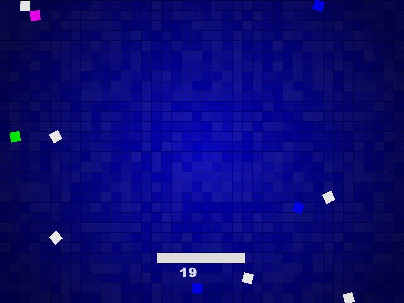

# Snake #
Snake is a little game I made to test out the LWJGL (Lightweight Java Game Library) for Java. The language itself is pretty verbose but after using LWJGL I can see why it has so much popularity in the Java game developer crowd.

## No longer updating this project ##
Sad to say but the project is no longer being updated, I've felt that snake in itself is complete and that I need to work on other projects

